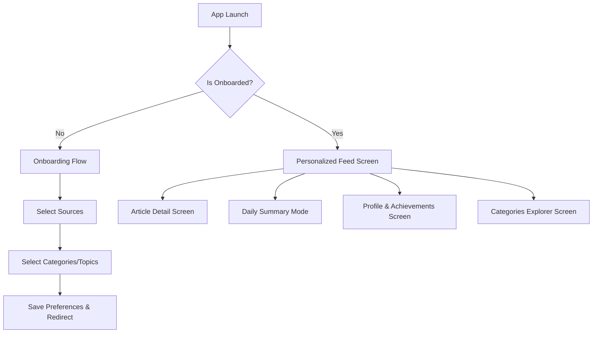

# VIBE - PRODUCT REQUIREMENTS DOCUMENT (PRD)

---

## 1. PROJECT OVERVIEW & CORE PHILOSOPHY

### 1.1 Executive Summary
**Vibe** is a premium, highly personalized information hub designed specifically for Dutch users (initially the founder and family members). Its primary goal is to eliminate information overload by acting as a single, calm gateway to daily digital content. Vibe replaces the routine of opening dozens of newsletters, news sites, and social feeds with one daily curated dashboard that values quality over quantity. 

Every item in the feed must earn its place. The application features zero infinite scrolling, highly custom visual feedback loops, playful gamification elements, and is delivered as a Progressive Web App (PWA) with a mobile-first design.

### 1.2 Core Philosophy
*   **Calmness & Intentionality:** Vibe is anti-doomscrolling. The feed has a defined ending point, showing only what is truly important, relevant, or requested by the user.
*   **Aesthetic Delight:** Heavily inspired by the playful contrast of Duolingo and the sleek security and visual weight of Wise. The app relies on smooth micro-animations, physical transitions, and tactile feedback.
*   **Cost Efficiency & YAGNI:** No paid APIs or constant cloud computing bills. LLM dependencies are banned from core routing, summarization, and data scraping. The scraping/parsing runs locally on the owner's laptop and pushes updates to a free-tier Supabase database.
*   **Maximum Transparency:** The "Why am I seeing this?" feature explains the exact deterministic scoring rule for every piece of content. No black-box algorithms.

### 1.3 Key Non-Goals
*   No multi-tenant scale optimization (built for <10 users).
*   No SaaS subscription modeling, paywall integrations, or monetization tracking.
*   No offline article reading (PWA is strictly for fast startup, mobile app appearance, and cached UI assets).
*   No complex AI vector embeddings or LLM-based categorization for core feed operations.

---

## 2. INFORMATION ARCHITECTURE & TAXONOMY

Vibe structures information in a strict, expandable hierarchy to map how human interests work. This taxonomy allows users to follow topics at broad or hyper-granular levels.

### 2.1 The Taxonomy Hierarchy
The schema supports a four-tier relationship:
$$\text{Category} \longrightarrow \text{Subcategory} \longrightarrow \text{Topic} \longrightarrow \text{Specific Entity}$$

#### Examples:
*   **Path A:** `Technology` (Category) $\rightarrow$ `Artificial Intelligence` (Subcategory) $\rightarrow$ `LLMs` (Topic) $\rightarrow$ `OpenAI` (Entity)
*   **Path B:** `Sports` (Category) $\rightarrow$ `Football` (Subcategory) $\rightarrow$ `Champions League` (Topic) $\rightarrow$ `FC Barcelona` (Entity)
*   **Path C:** `News` (Category) $\rightarrow$ `Dutch Politics` (Subcategory) $\rightarrow$ `Cabinet` (Topic) $\rightarrow$ `Geert Wilders` (Entity)
*   **Path D:** `Finance` (Category) $\rightarrow$ `Stock Markets` (Subcategory) $\rightarrow$ `Semiconductors` (Topic) $\rightarrow$ `ASML` (Entity)

### 2.2 Taxonomy Constraints
1.  **Many-to-Many Mappings:** An entity (e.g., `ASML`) can be mapped to multiple topics (e.g., `Semiconductors`, `AEX Index`, `Veldhoven Local`).
2.  **Inheritance Rules:** If a user follows a parent node (e.g., `Artificial Intelligence`), they implicitly receive high-relevance boosts for all child topics and entities unless explicitly muted.

---

## 3. CORE FEATURE SPECIFICATIONS

### 3.1 Playful Onboarding Flow
*   **The UX Concept:** A series of swipeable, self-correcting cards modeled after Duolingo's interactive quizzes.
*   **Step-by-Step Flow:**
    1.  **Welcome:** A large, bouncing illustration (Pony-tail theme / Vibe mascot) with a primary "Let's build your feed" button.
    2.  **Core Sources selection:** Displays logos of Dutch sources (NOS, RTL Nieuws, Tweakers, RTL Z, Rijksoverheid, local newspapers). Toggle cards with a satisfying "pop" sound.
    3.  **Topic Tree Selection:** Interactive bubble elements representing root Categories. Tapping a bubble expands it into subcategory chips.
    4.  **Priority Preference:** Selection slider defining the default feed density and priority filter (Breaking Only, Important, Everything).
    5.  **Completion Screen:** Celebration animation using CSS confetti and a daily reading commitment card (e.g., "5 minutes a day").

### 3.2 Personalized Feed & Heuristic Scoring
Since AI models are costly and slow, Vibe uses a deterministic, transparent heuristic scoring algorithm. Every article ingested is scored per user.

#### The Heuristic Scoring Formula
For a given User $u$ and Article $a$, the relevance score $S_{u,a}$ is calculated as:

$$S_{u,a} = \left( W_{\text{source}} \times I_{\text{source}} \right) + \sum (W_{\text{interest}} \times M_{\text{interest}}) + \text{PriorityBoost} - \text{Decay}(t)$$

Where:
1.  **Source Preferences ($W_{\text{source}}$):**
    *   Preferred source: $+3.0$
    *   Neutral source: $+1.0$
    *   Muted source: $-\infty$ (Filtered out immediately)
2.  **Interest Match Weight ($\sum (W_{\text{interest}} \times M_{\text{interest}})$):**
    *   Direct match on Pinned Tag / Favorite Entity: $+5.0$ per match
    *   Direct match on followed Topic: $+3.0$ per match
    *   Direct match on followed Subcategory: $+1.5$ per match
    *   Muted Entity/Topic: $-\infty$ (Filtered out immediately)
3.  **Priority Boost ($\text{PriorityBoost}$):**
    *   Breaking News marker: $+8.0$
    *   National / Important News flag: $+4.0$
4.  **Time Decay ($\text{Decay}(t)$):**
    *   $$\text{Decay}(t) = \lambda \times t^{1.5}$$
    *   Where $t$ is the age of the article in hours, and $\lambda = 0.2$. This ensures articles degrade quickly after 24 hours.

#### Feed Mechanics
*   **No Infinite Scroll:** The feed is capped at a maximum of **20 articles per session update**. Once a user finishes reading the 20 articles, they reach the "Clean Slate" screen.
*   **The "Clean Slate" Screen:** Displays a calm, animated SVG illustration (e.g., a windmill slowly turning against a sunset gradient) with the text: *"Je bent helemaal bij"* (You are completely up-to-date).

### 3.3 "Why Am I Seeing This?"
To build trust, clicking an info icon (ℹ️) on any card opens a micro-modal detailing the scoring composition:
*   *Example 1:* "Dit artikel staat in je feed omdat je **ASML** (+5.0) volgt en het is geplaatst door **Tweakers** (+3.0)."
*   *Example 2:* "Dit is **Breaking Nieuws** (+8.0) van de **NOS** (+3.0), ondanks dat je het onderwerp Politiek niet actief volgt."

### 3.4 Feedback Loops & Preferences
Users have active control over feed behavior via long-press or swipe quick actions:
*   **"Show Me Less":** Decreases the weight of the primary tag on the article by 50% for 30 days.
*   **Mute Topic/Entity:** Creates an exclusion row in `user_muted_interests` database table, dropping relevance to $-\infty$.
*   **Prefer Source:** Toggles source preference scaling factor in user preferences.

### 3.5 Daily Summary ("De Ochtend / Avond Vibe")
*   Runs twice daily: 07:30 (Morning) and 18:30 (Evening).
*   Gathers the top 5 highest-scoring articles across all categories into a sleek, swipeable "Stories" UI format (similar to Instagram/TikTok).
*   No AI summary needed. It uses the original publication's lead paragraph, clean typography, reading time estimate, and a direct link to the full view.

### 3.6 Gamification (Streaks & Achievements)
*   **Streaks:** Increment a daily counter if the user opens the app and reads at least 3 articles.
*   **Visual Reinforcement:** A flaming orange tulip icon in the header that animates dynamically when active.
*   **Achievements:** Playful badges unlocked on specific milestones:
    *   *De Vroege Vogel:* Read an article before 07:00.
    *   *Nieuws Junkie:* Reach a 14-day streak.
    *   *Lokale Held:* Follow a Dutch city and read 5 local articles.
*   **Minimalist Notification:** Unlocked achievements trigger a clean toast notification with a subtle pop sound.

### 3.7 Notification Strategy & Quiet Hours
To maintain a calm atmosphere, notifications are strictly scheduled:
*   **Quiet Hours:** Forced mute between 22:00 and 07:00 (local Dutch time).
*   **Daily Caps:** Users can cap generic alerts (e.g., Max 3 notifications per day).
*   **Granular Toggles:** Users toggle notifications at the Topic level (e.g., Only get notifications for `Formula 1` and `Breaking News`).

### 3.8 Location Awareness
*   Uses browser geolocation to query the city name via a free reverse-geocoding API (or simple IP geolocation).
*   **Privacy-first:** Exact coordinates are *never* sent or saved. Only the city name (e.g., "Rotterdam", "Veldhoven") is mapped in the user session.
*   **Influence:** Elevates articles flagged with the matching Dutch municipality name in the feed (+2.0 points).

---

## 4. UX FLOW, ARCHITECTURE, & INTERACTION DESIGN

### 4.1 Core Screen Flows


### 4.2 Tab Navigation Structure
A bottom bar navigation designed for thumb-reach access on mobile devices:
1.  **Feed (Home):** The top 20 personalized articles, with the Daily Summary button floating at the top right.
2.  **Explore:** Category categories grid, trending topics, search bar.
3.  **Stats:** Streak calendar, unlocked badges, categories breakdown charts.
4.  **Instellingen (Settings):** Location toggles, source preferences, quiet hours, and notification rules.

### 4.3 Animation & Gesture Design
Every gesture in Vibe must feel physical and spring-loaded.

| Trigger / Gesture | Target Element | Animation / Transition Description | Timing / Curve |
| :--- | :--- | :--- | :--- |
| **Swipe Left** | Feed Article Card | Slide card to hide it with red background gradient revealing "Mute" icon | `cubic-bezier(0.25, 1, 0.5, 1)` (300ms) |
| **Swipe Right** | Feed Article Card | Slide card to save it with green background gradient revealing "Pin" icon | `cubic-bezier(0.25, 1, 0.5, 1)` (300ms) |
| **Pull to Refresh** | Feed Stream | Elastic spring pulling down, spinning Dutch windmill SVG that pops upon load | Spring physics (`stiffness: 300, damping: 20`) |
| **Tap Category Chip** | Category Chip | Scale down to `0.95`, then expand outward with a subtle wave effect | 150ms linear-out |
| **Streak Increase** | Tulip Header Icon | Small rotation wobble (wiggle) followed by temporary glow scaling | Spring physics (`stiffness: 400, damping: 10`) |

---

## 5. VISUAL DESIGN SYSTEM

Vibe uses a vibrant, high-contrast palette combined with clean, modern typography.

### 5.1 Color Palette (Tailwind CSS Config tokens)
```javascript
module.exports = {
  theme: {
    extend: {
      colors: {
        background: {
          light: '#F8FAFC',   // Off-white, soft paper texture feel
          dark: '#0B0F19'     // Deep space dark blue (not pure black for premium feel)
        },
        primary: {
          tulip: '#FF5A36',   // High-contrast, vibrant Dutch orange
          gold: '#FFB800'     // Premium gold accent for streak achievements
        },
        neutral: {
          cardLight: '#FFFFFF',
          cardDark: '#161F30',
          textLight: '#1E293B',
          textDark: '#E2E8F0'
        },
        accent: {
          success: '#10B981', // Wise-green for read/save actions
          danger: '#EF4444'   // Alert red
        }
      }
    }
  }
}
```

### 5.2 Typography
*   **Title/Heading Font:** `Outfit` (Google Fonts) - Clean, rounded, premium geometry.
*   **Body Text Font:** `Inter` (System Sans Serif fallback) - Highly readable at small sizes.
*   **Base Sizing Grid:**
    *   H1: `2.25rem` (36px) - bold, tracked tight.
    *   H2: `1.5rem` (24px) - semi-bold.
    *   Body: `1.0rem` (16px) - regular, leading relaxed (`1.625`).
    *   Metadata: `0.875rem` (14px) - medium, muted colors.

### 5.3 Elevation & Shapes
*   **Border Radius:** `24px` for large cards, `16px` for normal category chips/buttons. Avoid sharp edges to preserve the playful aesthetic.
*   **Shadows:** Low-opacity, wide-blur shadows.
    *   `shadow-premium`: `0 10px 30px -10px rgba(11, 15, 25, 0.08)`

---

## 6. TECHNICAL ARCHITECTURE

Vibe uses a highly simplified tech stack designed for maintainability and low resource utilization.

```
+-------------------------------------------------------------+
|                        Next.js Frontend (Vercel)            |
|  - React 19 / Tailwind CSS / Shadcn/ui                      |
|  - PWA Web Manifest & Service Worker                        |
+------------------------------+------------------------------+
                               |
                   PostgreSQL Read/Write queries
                               |
                               v
+-------------------------------------------------------------+
|                      Supabase Backend (Free Tier)           |
|  - PostgreSQL Database (Tables, Indexes)                    |
|  - Supabase Auth (OTP / Passwordless login)                 |
+------------------------------+------------------------------+
                               ^
                       Data push (HTTPS)
                               |
+-------------------------------------------------------------+
|                   Local Scraping Engine (Laptop)            |
|  - Node.js RSS & Web Scraping engine                        |
|  - Executes via Cron on laptop                              |
+-------------------------------------------------------------+
```

### 6.1 Frontend: Next.js + Tailwind + shadcn/ui
*   Deploy target: Vercel Free tier.
*   Client-side rendering (CSR) for customized feeds, layout states, and local geolocations.
*   Next.js server actions are *not* needed; direct database queries can be executed via the Supabase JS Client SDK.

### 6.2 Backend: Supabase
*   Free Tier database: 500MB storage limit (more than enough for personal feed logs).
*   Authentication: Simple Email OTP (one-time passcode) or passwordless magic link to avoid complex credential management.

### 6.3 PWA Configuration
*   **Manifest:** `/public/manifest.json` specifies standalone mode, Dutch locale (`nl-NL`), and startup orientation (`portrait-primary`).
*   **Service Worker:** A simple `/public/sw.js` script to handle asset pre-caching (`/fonts`, `/icons`, static layouts) for instant app startup. It does *not* cache dynamic article content to avoid cache-invalidation logic overhead.

---

## 7. DATABASE SCHEMA (PostgreSQL DDL)

Here is the production-ready schema to be run inside Supabase.

```sql
-- Enable UUID extension
CREATE EXTENSION IF NOT EXISTS "uuid-ossp";

-- USERS TABLE
CREATE TABLE users (
    id UUID PRIMARY KEY DEFAULT uuid_generate_v4(),
    email VARCHAR(255) UNIQUE NOT NULL,
    created_at TIMESTAMP WITH TIME ZONE DEFAULT CURRENT_TIMESTAMP,
    city_name VARCHAR(100),
    reading_streak INTEGER DEFAULT 0,
    max_streak INTEGER DEFAULT 0,
    last_read_at TIMESTAMP WITH TIME ZONE
);

-- CATEGORIES TABLE
CREATE TABLE categories (
    id SERIAL PRIMARY KEY,
    name VARCHAR(100) UNIQUE NOT NULL,
    slug VARCHAR(100) UNIQUE NOT NULL,
    icon_name VARCHAR(50) NOT NULL
);

-- SUBCATEGORIES TABLE
CREATE TABLE subcategories (
    id SERIAL PRIMARY KEY,
    category_id INTEGER REFERENCES categories(id) ON DELETE CASCADE,
    name VARCHAR(100) NOT NULL,
    slug VARCHAR(100) NOT NULL,
    UNIQUE(category_id, slug)
);

-- TOPICS TABLE
CREATE TABLE topics (
    id SERIAL PRIMARY KEY,
    subcategory_id INTEGER REFERENCES subcategories(id) ON DELETE CASCADE,
    name VARCHAR(100) NOT NULL,
    slug VARCHAR(100) NOT NULL,
    UNIQUE(subcategory_id, slug)
);

-- ENTITIES TABLE (Companies, people, locations, sports teams)
CREATE TABLE entities (
    id SERIAL PRIMARY KEY,
    name VARCHAR(255) UNIQUE NOT NULL,
    entity_type VARCHAR(50) NOT NULL, -- 'company', 'person', 'sport_team', 'location', 'tech'
    slug VARCHAR(255) UNIQUE NOT NULL
);

-- ARTICLES TABLE
CREATE TABLE articles (
    id UUID PRIMARY KEY DEFAULT uuid_generate_v4(),
    source_name VARCHAR(100) NOT NULL,
    title TEXT NOT NULL,
    description TEXT,
    url TEXT UNIQUE NOT NULL,
    published_at TIMESTAMP WITH TIME ZONE NOT NULL,
    image_url TEXT,
    reading_time_minutes INTEGER DEFAULT 2,
    is_breaking BOOLEAN DEFAULT FALSE,
    content_hash VARCHAR(64) UNIQUE NOT NULL, -- Used to prevent duplicate imports
    created_at TIMESTAMP WITH TIME ZONE DEFAULT CURRENT_TIMESTAMP
);

-- ARTICLE TAXONOMY MAPPING
CREATE TABLE article_taxonomy (
    article_id UUID REFERENCES articles(id) ON DELETE CASCADE,
    category_id INTEGER REFERENCES categories(id) ON DELETE SET NULL,
    subcategory_id INTEGER REFERENCES subcategories(id) ON DELETE SET NULL,
    topic_id INTEGER REFERENCES topics(id) ON DELETE SET NULL,
    entity_id INTEGER REFERENCES entities(id) ON DELETE SET NULL,
    PRIMARY KEY (article_id, category_id, subcategory_id, topic_id, entity_id)
);

-- USER PREFERENCES & INTEREST WEIGHTS
CREATE TABLE user_preferences (
    id UUID PRIMARY KEY DEFAULT uuid_generate_v4(),
    user_id UUID REFERENCES users(id) ON DELETE CASCADE,
    interest_type VARCHAR(50) NOT NULL, -- 'category', 'subcategory', 'topic', 'entity', 'source'
    interest_id VARCHAR(100) NOT NULL, -- Can point to category_id, topic_id, source name string
    preference_weight REAL DEFAULT 1.0, -- Range: -1.0 (muted) to +5.0 (pinned/favorite)
    UNIQUE(user_id, interest_type, interest_id)
);

-- USER ARTICLE INTERACTIONS (For read tracking, saving, and streaks)
CREATE TABLE user_article_interactions (
    user_id UUID REFERENCES users(id) ON DELETE CASCADE,
    article_id UUID REFERENCES articles(id) ON DELETE CASCADE,
    is_read BOOLEAN DEFAULT FALSE,
    is_saved BOOLEAN DEFAULT FALSE,
    read_at TIMESTAMP WITH TIME ZONE,
    interacted_at TIMESTAMP WITH TIME ZONE DEFAULT CURRENT_TIMESTAMP,
    PRIMARY KEY (user_id, article_id)
);

-- INDEXES FOR HEURISTIC SCORING OPTIMIZATION
CREATE INDEX idx_articles_published ON articles(published_at DESC);
CREATE INDEX idx_interactions_user_read ON user_article_interactions(user_id, is_read);
```

---

## 8. API INTEGRATION, DEDUPLICATION, & CACHING STRATEGIES

### 8.1 List of Target RSS Feeds (Netherlands Focused)
*   **NOS Nieuws (Algemeen):** `https://feeds.nos.nl/nosnieuwsalgemeen`
*   **NOS Politics:** `https://feeds.nos.nl/nosnieuwspolitiek`
*   **RTL Nieuws (Algemeen):** `https://www.rtlnieuws.nl/rss/feed.xml`
*   **RTL Z (Finance/Business):** `https://www.rtlnieuws.nl/rss/rtlz/feed.xml`
*   **Tweakers (Technology):** `http://feeds.feedburner.com/tweakers/mixed`
*   **NU.nl (Breaking Feed):** `https://www.nu.nl/rss/Algemeen`
*   **Rijksoverheid (Official Govt Announcements):** `https://www.rijksoverheid.nl/actueel/nieuws/rss`

### 8.2 Scraping Architecture: Laptop Engine
A small Node.js service running on the developer’s local laptop using a scheduling tool (e.g., Windows Task Scheduler or launchd/cron) executes once every **60 minutes** between 07:00 and 23:00.

#### Processing Steps:
1.  **Fetch & Parse:** Downloads feed XMLs using a native parser library.
2.  **Deduplicate Content:**
    *   Calculates a SHA-256 content hash of the cleaned title + url (`content_hash`).
    *   Before uploading to Supabase, queries existing articles from the past 48 hours to check for duplicate `content_hash` or a Jaro-Winkler title similarity score > 0.85 (handling cases where RTL and NOS publish identical headlines).
3.  **Automatic Tagging:** Runs keyword-matching logic based on predefined strings:
    *   If title contains "Kamer", "Rutte", "Schoof", "Wilders" $\rightarrow$ Map to Subcategory: `Dutch Politics`.
    *   If title contains "AEX", "ASML", "Inflatie" $\rightarrow$ Map to Subcategory: `Dutch Finance`.
    *   If title contains "Ajax", "Feyenoord", "Formule 1", "Verstappen" $\rightarrow$ Map to Category: `Sports`.
4.  **Database Push:** Executes standard `INSERT ON CONFLICT DO NOTHING` statements to Supabase API endpoints.

---

## 9. MVP PHASE BREAKDOWN (MoSCoW Matrix)

To align with the YAGNI principle and prevent scope creep, the features are divided into strict release categories.

### 9.1 MUST HAVE (Release 1.0 - Core Engine)
*   Supabase database structure & authentication via Email magic links.
*   The automated laptop ingestion engine pushing articles to Supabase.
*   Basic dashboard displaying the heuristic-sorted top 20 news items.
*   Manual preferences editor (following basic categories and sources).
*   "Why am I seeing this?" info modal.
*   "Less Like This" quick-swipe hide action.

### 9.2 SHOULD HAVE (Release 1.1 - Gamification & Experience)
*   The PWA manifest configuration for full-screen home-screen installation.
*   Daily summary popup mode ("De Ochtend Vibe" / "De Avond Vibe").
*   Onboarding screen flow for category & topic selection.
*   Reading streak tracker calculation script.
*   Swipe left to hide/mute, swipe right to save/bookmark.

### 9.3 COULD HAVE (Release 1.2 - Delighters)
*   Sound effects on streak milestone achievements (optional toggles).
*   Unlockable achievement badges (SVG designs).
*   Reverse geocoding city lookup for local priority adjustments.
*   Density configuration setting (Compact vs. Large layout variants).

### 9.4 WON'T HAVE (Future Scopes)
*   Offline database replication engines (Requires IndexedDB / heavy PWA sync loops).
*   AI/LLM-based abstractive summarization.
*   Paid premium API partnerships.
*   Multi-tenant billing systems or payment integrations.

---

## 10. CRITICAL SELF-REVIEW & IMPROVEMENT

### 10.1 Self-Review Critique
Before committing this document as the final roadmap, let us challenge several core architectural decisions.

1.  **Scraping Deduplication Accuracy:** Relies on keyword triggers. Simple regex tagging will result in high false positives (e.g., matching "ASML" but tagging it as "General News" rather than "Technology" or "Semiconductors").
2.  **Cold Start User Experience:** If a user registers and has zero streaks and zero interaction history, the feed sorting algorithm will fallback to standard timestamp sorting. This makes the onboarding process critical.
3.  **Local Job Dependency:** Relying on a laptop cron job means that if the laptop is shut down or has no internet connection, the database updates halt. While acceptable for a personal tool, it could frustrate family members.
4.  **Database Size Bounds on Free Tier:** If we store every article indefinitely, the 500MB Supabase free limit will be breached within 6-9 months. We need a strict data purging policy.

---

## 10.2 REFINED PRODUCTION IMPLEMENTATIONS (The Final Spec)

To address the critique points above, the following final specs are added to the PRD:

#### 10.2.1 Data Retention & Purge Job (YAGNI & Database Conservation)
To keep the database footprint under the Supabase 500MB limit indefinitely, a cleanup script is scheduled to run daily at 04:00 (local time) via the laptop engine:
```sql
-- Permanently delete articles older than 14 days that have NOT been favorited or bookmarked by any user.
DELETE FROM articles
WHERE published_at < NOW() - INTERVAL '14 days'
  AND id NOT IN (
      SELECT DISTINCT article_id 
      FROM user_article_interactions 
      WHERE is_saved = TRUE
  );
```

#### 10.2.2 Cold Start Recommendation Strategy
During onboarding, a new user must select a minimum of 3 categories. For the first 48 hours, Vibe assigns a default database profile weight of `+3.0` to all articles matching those 3 chosen categories, mitigating the cold-start sorting issue.

#### 10.2.3 Automatic Tagging Refinement
Instead of complex NLP engines, the laptop parser will load a simple JSON taxonomy mapping file (`/config/taxonomy_rules.json`). This keeps standard categorization light, customizable, and easily editable by the developer:
```json
{
  "Dutch Politics": ["tweedekamer", "fractieleider", "coalitieakkoord", "regering"],
  "Semiconductors": ["asml", "tsmc", "chipmachine", "nxp", "半導体"],
  "F1 Racing": ["max verstappen", "red bull racing", "grand prix", "fia"]
}
```

#### 10.2.4 Scraping Heartbeat Dashboard
To ensure family members don't get stuck with stale feeds when the developer's laptop is closed, a simple visual banner appears at the top of the feed if the latest article in the database is older than **4 hours**:
*   *"Laatste update: X uur geleden. De verbinding met het scraping station is tijdelijk onderbroken."* (Last update: X hours ago. Connection with the scraping station is temporarily interrupted).

This transparency adheres strictly to the **Calm & Transparent** philosophy, keeping the codebase simple and the user informed.
